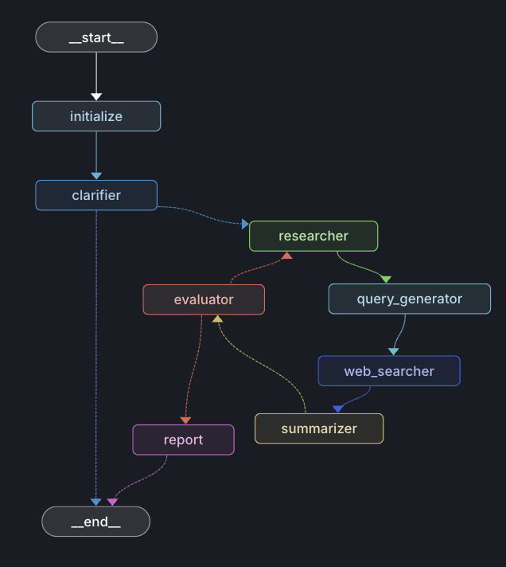

# Design Document

<!-- ## Overview

I wanted to create a deep research agent that mirrors a general workflow when researching a new topic in a academic lab. Initially, the principle investigator (PI) will provide a topic, then the researchers will create queries based on the topic and read information online. For example take the topic, "How does weather affect COVID-19 transmission." The researcher maybe google 5 different queries related to this topic like "correlations between temperature and COVID-19" for example." The researcher would then read multiple different angles to approach the problem, collate all the learnings from the review, then discuss with the PI. The PI will then decide which part of the review is relevant and request the researchers to focus on that area. The researchers and the PIs would iteratively perform searches like this till they have reached a point where they have answers to the initial query.  -->

## Architectural Choices 

Like I mentioned above, I wanted to create an architecture that mirrored the general human process while researcher. LangChain's open_deep_researcher and local_deep_researcher both do this and make use of cycles that involve web searches and summarizations overseen by a supervisor. 

Further, open_deep_researcher uses an agent to clarify the scope, occasionally asking the user to clarify their message to the agent. I chose to incorporate this idea since it allows the user to have a well defined scope before the agents commits to the process of researching on the user's behalf. 

Here are the components of my architecture and what each does briefly 
- `initialize`: logs the incoming message and allows for any initialization to be added later on 
- `clarifier`: analyzes if the query is too vague or ambiguous otherwise continues to researcher 
- `researcher`: defines the research focus by generating a couple key research questions based on the query and the clarification if any 
- `query_generator`: converts the research questions into optimized web search queries 
- `web_searcher`: executes Tavily searches and collects raw web sources 
- `summarizer`: agents to summarize each source in parallel. Reduces all sources into one summary 
- `evaluator`: checks if all questions are answered. If satisfied or max iterations are reached, it routes to generate the final report, if not it loops back to the researcher. 
- `report`: generates the final report from accumulation of findings

* I chose to include a `query_generator` because I found that the research questions that the `researcher` produced were detached from the research topic and are very broad. For example, to research the correlation between weather and COVID-19, a research question the agent produced was "What data has been used to study this?': 'Analysis on global and regional COVID-19 infection rates, weather patterns including temperature, humidity, ..." Even if this was synthesized I didn't think it could be transformed into an effective search query. I thought this justified creating a different node that specialized in converting the questions to search queries 

* I'll discuss more about the functionality of each in the next sections 


### Experiments: what worked and what didn't 

#### Prompting for clarification 
For the `clarifier`, I spent a lot of time trying to get the right balance between conveying what kinds of prompts are ambiguous.  
Here is what I tried: 
* My initial idea was that given the query, the agent brainstorms a couple follow up questions to ensure that the research is tailored to the users priorities. I implemented this, but I thought it is too tedious to ask the user to read and respond to each of the questions the agent has. If there was a way the user could just check which of the questions they'd want to include in the search it would be more practical. 
* Thus, I pivoted to something less involved for the user. I tried a simple prompt where I asked the agent to ask for more clarification on the topic if it seem vague or too broad. More often than not this would ask a clarification. I wanted the agent to reason about this choice a bit more and only ask a clarification if there is something missing in the users prompt. 
* I added specific example of when to ask for clarification and when to avoid asking for clarification. The example I gave was if a user prompts "Tell me about past wars" then a good follow-up clarifying question could be: 
"Is there a specific region you want me to focus on? What type of information are you looking for (causes, outcomes, impacts, etc)?"  I also provided an example of when to not ask for clarifications: "Investigate the key events leading up to the recent conflict in Ukraine. I want to focus on geopolitical factors and since 2014." This did seem to help create a balance and the agent asked questions that were similar to the clarification I provided in the example. 
* I prepended a few sentences detailing the general role of the system and the agent. I've read some papers where providing agents with context of what type of task it will be doing before asking it to do the task can increase the accuracy of its response. This did help with the tone. Given that this worked, I used it for almost all the other prompts as well. 

These tests gave me a better idea of how to prompt the agents and the amount of information and tailoring that has to be done in order to create a node and ensure it behaves as expected. I kept the examples and general role in the prompt. Overall, it is hard to tell when you have achieved a good balance, so it would be useful to allow the user to decide if they want the agent to ask for clarification or if they would prefer the agent just follows the initial query. 

#### Single Agent vs Multiple Agents 
* Initially I had a single agent doing all the reading and summarizing for all the web sources. However, the issue with this was it forced a limit on how many words from each source could be incorporated before the context limit was met. 
* This approach still produced good preliminary results. However, I realized it would make more sense to split the sources up into a dedicated agent for each source rather than 1 agent for all the sources. This way each agent only had to summarize what is relevant to that web page. This allows the full page to be passed so all the information is considered before generating a summary. 
* This approach took too long to process 10/15 sources. Thus, I attempted to parallelize the agents using the Map-Reduce pattern since I was more familiar with it. This greatly reduced the computation time of the system. 

#### Choosing the right agent for the task  
* I started with GPT-4 for all nodes. However, I realized that this causes a delay in producing the summaries for each of the web results. 
* I tested out a smaller model like GPT-3.5 for summarizations and this helped with the time issue. I realized that GPT-4 was overkill just for summarizing, and GPT-3.5 did a good enough job at grabbing the main points. 
* For more important tasks like generating the final report and planning the research, GPT-4 had high reasoning capabilities. Further, it identified must stronger gaps in existing research. For example, taking the COVID and weather example again, GPT-3 only identified trends like precipitation causes an increase in positivity rate, while GPT-4 identified that the relationship between positivity rate and precipitation actually relies on the region. 

#### Number of cycle iterations  
* A key questions I encountered early on was how many iterations through the web scrapping to summary to researcher was "enough."
* After testing many queries, I realized that this just depends on the query asked. Some queries, the model are able to reason about quickly and come to a conclusion, however for more obscure topics they may need a couple more iterations. 
* Initially I had a fix number of iterations that I would manually switch and then I realized the `evaluator` node could be added to check if the initial research questions had been adequately answered. It allowed the agent to decide based on the context whether another iteration was needed. This created a more flexible approach that adapted well to simple and complicated queries. 

### Limitations / Future ideas 
* I realized I could have used LangGraph Subgraphs later on to create a nested graph rather than the cycle of nodes I have currently. I think this would result in a cleaner design in terms of what is visible to the user and also since it would allow the subgraph to have its own state. I would implement this by creating something like the below snippet:

```python
# Create a subgraph
research_subgraph = StateGraph(ResearcherState)
research_subgraph.add_node("researcher", researcher_node)
research_subgraph.add_node("query_generator", query_generator_node)
...
research_subgraph.add_node("evaluator", evaluate_progress_node)

# Connect nodes 
research_subgraph.add_edge("researcher", "query_generator")
...
research_subgraph.add_edge("summarizer", "evaluator")
# evaluator conditionally loops back to researcher or exits

compiled_subgraph = research_subgraph.compile()

# Main graph uses subgraph as a single node
main_graph = StateGraph(ResearchState)
main_graph.add_node("initialize", initialize_state)
main_graph.add_node("clarifier", clarification_node)
main_graph.add_node("research_cycle", compiled_subgraph)  
main_graph.add_node("report", report_generation_node)
```
* I also think there is scope for improvement with how the `messages` field is managed. Currently I just chain on messages and the summarizes created at the end of each cycle. However, I think it would be more useful to connect the summarizes with the research question it was answering to provide more context to the next iteration. I would probably implement this as a new field and have a list of each question and list of summaries answering it. 

* I also wanted to add in a knob that allowed the user to toggle on/off the `clarifier` node. I would implement this in the configurations files. I would also implement an easily changeable flag for the max iterations for the sub cycle in the graph. 

* The functions for the nodes and creation of the graph could also be split up into different modules. That was my initial design then it became a bit too cumbersome to debug with two different files so I decided to combine them for easy of debugging. However if this was a larger scale project I would have employed more decoupling strategies as stated above. 
